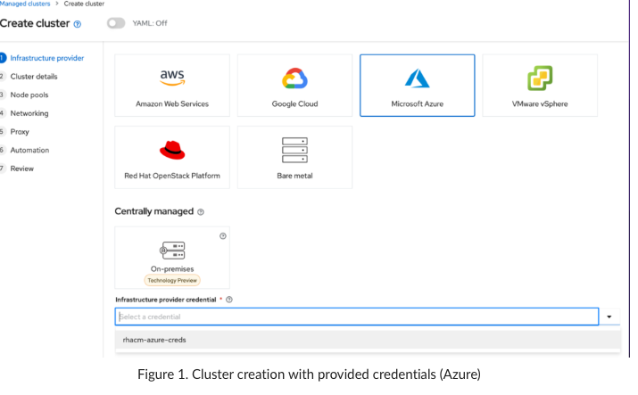

# Azure
## Credentials

First, an OpenShift instance in Azure needs to be deployed. This is to be done in RHACM using the "apps of apps" methodology. The Hive job terra-forms an instance of OpenShift as authorized by an Azure AD application with the relevant permission scopes. This [card](https://trello.com/c/3SyyorDR/46-rhacm-azure), on Trello, contains the application details.

A "Credential" resource definition was made from the details provided above in the link, as seen [here](https://multicloud-console.itzroks-50b01ssfct-3srax4-6ccd7f378ae819553d37d5f2ee142bd6-0000.eu-gb.containers.appdomain.cloud/multicloud/credentials/view/azure-cluster-0/rhacm-azure-creds). Simply reference this credential when creating an Azure Cluster, either manually or automatically, in RHACM. You do not need to create a new one. The base domain and resource group for our shared Azure Account are also included within the "Credential" object spec. If you are using a different Azure Account, create a new credential accordingly. If you are using an existing Azure credential in RHACM (which is the most likely scenario), simply specify "rhacm-azure-creds" as the credentials when creating an OpenShift in Azure, as seen in Figure 1 below.




**Follow this [link](https://access.redhat.com/documentation/en-us/red_hat_advanced_cluster_management_for_kubernetes/2.4/html/credentials/credentials#creating-a-credential-for-microsoft-azure) for instructions on how to create a "Credential" object** (That is, rhacm-azure-creds in Figure 1 above). We (eventually) encountered the following error as seen in the Hive logs:


```
level=error level=error msg=Error: authorization.RoleAssignmentsClient#Create: Failure responding to request: StatusCode=403 -- Original Error: autorest/azure: Service returned an error. Status=403 Code="AuthorizationFailed" Message="The client 'fc1e1c80-653b-4945-b584-e803e2af89ea' with object id 'fc1e1c80-653b-4945-b584-e803e2af89ea' does not have authorization to perform action 'Microsoft.Authorization/roleAssignments/write' over scope '/subscriptions/f9700497-11d3-4005-8b1d-3bf45a667424/resourceGroups/azure-rhacm-cluster-1-cckmm-rg/providers/Microsoft.Authorization/roleAssignments/045dbb0f-3d0a-5b3c-0fda-6126835daa03' or the scope is invalid. If access was recently granted, please refresh your credentials."
```


The relevant section is bolded. The permission to write/assign roles seems to be missing. According to the [link](https://access.redhat.com/documentation/en-us/red_hat_advanced_cluster_management_for_kubernetes/2.4/html/credentials/credentials#creating-a-credential-for-microsoft-azure) however, creating a service principal (which ultimately generates the client id and secret) is given by this command:

`az ad sp create-for-rbac --role Contributor --name <service_principal>`

[[The inbuilt role, "Contributor" however, is described as given below, according to this [link](https://docs.microsoft.com/en-us/azure/role-based-access-control/built-in-roles):

"Grants full access to manage all resources, **but does not allow you to assign roles in Azure RBAC** , manage assignments in Azure Blueprints, or share image galleries".

The relevant part is bolded, note the assignment of roles is not allowed, in direct agreement with the error log provided above. As a workaround, we executed the command given above, replacing Contributor with Owner (another inbuilt role, see [here](https://docs.microsoft.com/en-us/azure/role-based-access-control/built-in-roles)). As an aside, another, and likely the better alternative, is to execute the above command with the Contributor role and added the --scope flag to add the relevant permission, thus abiding by the concept of least privilege for the service principal in question. 


## Submariner

There are a couple of options to perform the automation on the infrastructure prior to deploying Submariner (Note in version 2.5, this will automatically be done on our behalf, similar to AWS. We don't have this luxury unfortunately at the time being), as seen [here](https://github.com/stolostron/submariner-addon/blob/main/docs/submarinerConfig.md) (refer to the limitations sections). In AWS, we simply used the SubmarinerConfig and away we go. The plan is leverage this API for Azure when available.

1. Ansible
2. Custom scripts executed by a Kubernetes job with an appropriate sync wave.

Official documentation states Ansible is a potential way to go about doing this, as stated [here](https://access.redhat.com/documentation/en-us/red_hat_advanced_cluster_management_for_kubernetes/2.4/html/clusters/managing-your-clusters#ansible-config-cluster). There is an Ansible tower resource deployed in the hub cluster, so this may be a consideration. Given our rather tight timelines, we opted for the latter (That is, choice 2).

We tried to leverage CRD's such as ClusterDeployments in order to configure the environment as much as possible in a IaC manner, compatible with our GitOps "App of Apps" approach. Unfortunately, there was not much we could have leveraged. For instance, the CRD specified [here](https://github.com/openshift/hive/blob/master/config/crds/hive.openshift.io_clusterdeployments.yaml) does not much options to configure Azure (The Azure stanza has about 30 lines with only a few fields we can use) which, unfortunately, could not be leveraged to perform the configurations specified [here](https://access.redhat.com/documentation/en-us/red_hat_advanced_cluster_management_for_kubernetes/2.2/html/manage_cluster/submariner#preparing-azure).


## Usage

Usage is fairly straightforward, refer to the following files given below:

1. [Deploy Submariner Application](https://github.com/one-touch-provisioning/otp-gitops/blob/master/0-bootstrap/3-apps/argocd/clusters/submariner/deploy-submariner.yaml)
2. [Configure Azure for Submariner](https://github.com/one-touch-provisioning/otp-gitops/blob/master/0-bootstrap/3-apps/argocd/clusters/submariner/configure-azure.yaml)

Once the clusters are created. Say, azure-cluster-01 and azure-cluster-02, add these clusters to the helm->values->clusterList field in the files above and perform a git push. This should trigger Argo to both configure the cluster and deploy the submariner operator.

Please do note however, the names of the clusters should be in this format: "azure-cluster-numberHere". For example, azure-cluster-01 and azure-cluster-02. See the paragraph below for an explanation. (I just copied the relevant comment in the script)

Right now, when a cluster is created in Azure, the resource group created to contain the resources within cannot be specified during config time. So we are at the mercy of the random five letter identifiers present in the resource group name. That said, there is fortunately a pattern we can leverage. Given a cluster name
of "azure-cluster-XX" (Here, XX is a unique number), the resource group created is of the format "azure-cluster-XX-abcde-rg" where abcde is the aforementioned random five letter identifier. Now, since azure-cluster-XX is unique (as XX is always going to be unique), the result of the grep command will also be unique.
This is how we currently map the openshift azure deployment to the resource group. The resource group is required as we perform some configurations on resources created within said resource group.

In addition, there seems to be a bug in RHACM whereby deleting a cluster will not clean up the relevant submariner artifacts from the cluster themselves. For instance, azure-cluster-shared-06 below has been destroyed, but submariner still thinks it is part of the cluster set.


In order to get around it, you need to manually delete the following:

1. The Endpoint objects (This is a Submariner CRD) still contain a reference to the destroyed cluster. The relevant entry needs to be deleted.
2. The ClusterObject CRD in the Hub Cluster will have an instance of the destroyed cluster still there. It needs to be manually removed.

The relevant script and associated Dockerfile is [here](https://github.com/Mattar555/azure-submariner-job), in the event in needs to merged upstream at some stage.


# AWS 

[Support matrix for submariner on our current rhacm version (2.4)](https://access.redhat.com/articles/6218901)

[RHACM 2.4 ](https://access.redhat.com/documentation/en-us/red_hat_advanced_cluster_management_for_kubernetes/2.4)

[Required ports](https://access.redhat.com/documentation/en-us/red_hat_advanced_cluster_management_for_kubernetes/2.4/html-single/install/index#network-configuration-submariner)
[Sub setup](https://access.redhat.com/documentation/en-us/red_hat_advanced_cluster_management_for_kubernetes/2.4/html-single/services/index)


## Components 

### Helm 
* Helm is used as a way of customising YAML files before they are applied 
* Helm was chosen over Kustomise due to its more dynamic nature. 
* installing Submariner on a dynamic list of AWS clusters requires the use of two specific Helm functions 
    * if (to check whether a cluster should be labelled for use with submariner) 
    * range (to loop through the cluster list values and create resources and deployments for each cluster

### ArgoCD and Resource Definitions 
* Two apps are defined in ArgoCD
    * An app to deploy submariner, and an app to provision clusters. 
    * Clusters are labelled at the point they are provisioned by helm 
    * This Argo Sync Wave occurs before Submariner is deployed 
    * Critically, we provide Helm with a list of clusters to add the label to 
```
apiVersion: cluster.open-cluster-management.io/v1
kind: ManagedCluster
metadata:
  labels:
    cloud: Amazon
    region: {{ .Values.provider.region }}
    name: '{{ .Values.cluster }}'
    vendor: OpenShift
    {{- if .Values.clusterSet.enabled }}
    cluster.open-cluster-management.io/clusterset: {{.Values.clusterSet.name}} 
    {{- end}}
  name: '{{ .Values.cluster }}'
  annotations:
    argocd.argoproj.io/sync-wave: "370"
spec:
  hubAcceptsClient: true
```

### RedHat Advanced Cluster Management (RHACM) 
* Submariner is deployed through RHACM as a ManagedClusterAddOn. This is a Custom Resource Definition inside RHACM
* RHACM needs to be installed fully before ManagedClusterAddOns can be created - we leverage ArgoCD sync waves to account for this.
```
{{- range .Values.clusterList }}
apiVersion: addon.open-cluster-management.io/v1alpha1
kind: ManagedClusterAddOn
metadata:
    name: submariner
    namespace: {{.}}
spec:
    installNamespace: submariner-operator
---
    {{- end }}    
``` 
### Submariner 

* Submariner is deployed on AWS using a ManagedClusterAddOn
* ManagedClusterAddOn is a Custom Resource Definition provided with RHACM 
* This ManagedClusterAddOn will spin up an extra node, and perform the administration work required to deploy submariner 
    * Open port 4800 and 4500 
    * Open port 8080 
    * Deploy the submariner operator 
    * label a node as a gateway node (submariner.io/gateway=true)
* One assumption here is that the cluster was provisioned through RHACM, or has access to the appropriate permissions to create MachineSets 

**Process** 

Manual: 
1. Created an AWS credential 
2. Provisioned an AWS cluster using the aforementioned credential within the RHACM console 
3. Added cluster to managed clusterset in RHACM console 
4. Install submariner add-on 

**GitOps** 

1. an ArgoCD app points to CRDs that provisions AWS clusters, and apply a clusterset label 
2. An ArgoCD app points to a directory that has CRDs for machineconfigs and managedclusteraddons
3. An ArgoCD app deploys the ManagedClusterAddOn to a clusterset and applies the machineconfigs 
4. RHACM will then spin up an additional node that will open ports and apply relevant permissions 

### Issues and Limitations 
1. Overlapping CIDR ranges 
    * Clusters within a clusterset must not have overlapping CIDR ranges. This can be checked using the submariner cli subctl diagnose all 
2. Need to refresh pods in the submariner namespace to fix outdated connection errors in RHACM 
    * Occasionally there is an issue that RHACM will show functioning deployments as 'status=error' or 'status=connecting'. To fix this simply oc delete pods --all -n submariner-operator and wait for the deployment to refresh 

