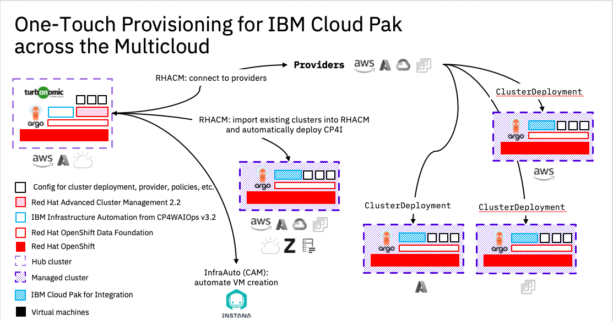
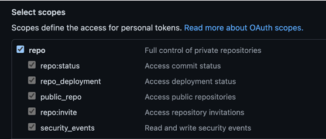

# One Touch Provisioning across Multi-Cloud

## Elevator Pitch

This method/pattern is our opinionated implementation of the GitOps principles, using the latest and greatest tooling available, to enable the hitting of one big red button (figuratively) to start provisioning a platform that provides Cluster and Virtual Machine Provisioning capabilities, Governence and policy management, observability of Clusters and workloads and finally deployment of IBM Cloud Paks and other applications, all within a single command*.

- Codified, Repeatable and Auditable.


*Disclaimer, may actually be more than just one command to type. 😉

The method/pattern is not intended to be used straight into Production, and a lot of assumptions have been made when putting this together. It's main intention is to show the `Art of the Possible`, but it can be used as base to roll your own.

Whilst all efforts have been made to provide a complete `One Touch Provisioning` method/pattern, it may not suit every environment and your mileage may vary.

## Shout outs 📣

This asset has been built on the shoulders of giants and leverages the great work and effort undertaken by the [Cloud Native Toolkit - GitOps Production Deployment Guide](https://github.com/cloud-native-toolkit/multi-tenancy-gitops), [IBM Garage TSA](https://github.com/ibm-garage-tsa/cp4mcm-installer) and [Red Hat Communities of Practice](https://github.com/redhat-cop) teams. Without these efforts, then this asset would have struggled to get off the ground.

The reference architecture for this GitOps workflow can be found [here](https://cloudnativetoolkit.dev/adopting/use-cases/gitops/gitops-ibm-cloud-paks/).  

## Table of contents

- [One Touch Provisioning across Multi Cloud](#one-touch-provisioning-across-multi-cloud)
  - [Elevator Pitch](#elevator-pitch)
    - [Shout outs](#shout-outs)
  - [Table of contents](#table-of-contents)
  - [Note](#note)
  - [Asset Capabilities](#asset-capabilities)
  - [Pre-requisites](#pre-requisites)
    - [Note](#note)
    - [Red Hat OpenShift cluster](#red-hat-openshift-cluster)
      - [IPI Methods](#ipi-methods)
      - [UPI Methods](#upi-methods)
      - [Managed OpenShift](#managed-openshift)
    - [CLI tools](#cli-tools)
    - [IBM Entitlement Key](#ibm-entitlement-key)
  - [Setup git repositories](#setup-git-repositories)
  - [Install and configure OpenShift GitOps](#install-and-configure-openshift-gitops)
    - [Configure manifests for Infrastructure](#configure-manifests-for-infrastructure)
  - [Bootstrap the OpenShift cluster](#bootstrap-the-openshift-cluster)
    - [Credentials](#credentials)
    - [Infrastructure Automation](#infrastructure-automation)
    - [Red Hat Advanced Cluster Management](#red-hat-advanced-cluster-management) 
  - [Managing OpenShift Clusters via OpenShift GitOps](#managing-openShift-clusters-via-openShift-gitOps)
  - [Managing IaaS Providers within IBM Infrastructure Automation](#managing-iaas-providers-within-ibm-infrastructure-automation)
  - [Deployment of Cloud Paks through OpenShift GitOps](#deployment-of-cloud-paks-through-openShift-gitOps)
  
## Note ✋

This repository provides an opinionated point of view on how tooling and principles such as `Terraform`, `Ansible` and `GitOps` can be used to manage the infrastructure, services and application layers of OpenShift/Kubernetes based systems. It takes into account the various personas interacting with the system and accounts for separation of duties.

It is assumed that you have already configured the compute, networks, storage, Security Groups, Firewalls, VPC, etc to enable the platform to be deployed. The asset will not perform those actions for you, and it will fail if you attempt to deploy it without those all pre-configured.

This respository is not intended to be a Step-by-Step Guide and some prior knowledge in OpenShift/Kubernetes/VM Provisioning is expected.

## Asset Capabilities 🚀

- The asset will deploy an opionated OpenShift Hub cluster running OpenShift GitOps, OpenShift Pipelines, OpenShift Data Foundation, Ansible Automation Platform (Additional Subscription required), Red Hat Advanced Cluster Management 2.4, Red Hat Advanced Cluster Security, OpenShift Virtualisation, IBM Infrastructure Automation from the IBM Cloud Pak for AIOps 3.2, SealedSecrets, Instana, Turbonomics and RHACM Observability.

- Deployment and management of Managed OpenShift Clusters via OpenShift GitOps (everything Infrastructure as Code) onto Amazon Web Services, Microsoft Azure, Google Cloud Platform, VMWare vSphere and Bare-metal environments, including Single Node OpenShift onto On Premise hosts. Treat Managed OpenShift Clusters as "cattle" not "pets' if desired.

- Deployed Managed OpenShift Clusters on AWS, Azure and GCP can be Hibernated when not in-use to reduce the amount of resources consumed on your provider, potentially lowering costs.

- Configured to Auto-Discover OpenShift Clusters from provided Red Hat OpenShift Cluster Manager credentials, and provide the opportunity to import the OpenShift clusters as Managed Clusters and automatically configure them into the OpenShift GitOps Cluster.

- Centralised OpenShift GitOps for deployment of Applications across any Managed OpenShift Cluster. View all deployed Applications across the entire fleet of OpenShift Clusters, regardless of Clusters location (i.e. AWS, GCP, on-premise etc).

- Automatically apply policies and governance to ALL Clusters within Red Hat Advanced Cluster Management, regardless of Clusters location.

- Hub Cluster can self-host Instana Virtual Machine using OpenShift Virtualisation and managed via OpenShift GitOps, or automatically deployed to an IaaS environment using IBM Infrastructure Automation.

- Can be configured to automatically connect to IaaS environments, enable deployment of Virtual Machines via IBM Infrastructure Automation and OpenShift Pipelines.

- Can be configured to automatically deploy applications to Managed Clusters via OpenShift GitOps. An example provided will deploy IBM Cloud Pak for Integration (utilising full GitOps Principles) to Managed Clusters.

### Coming Soon

- Zero Touch Provisioning of Managed OpenShift Clusters to Bare-metal nodes (think Edge deployments)

## Pre-requisites ⬅️

### Red Hat OpenShift cluster ⭕

Minimum OpenShift v4.8+ is required.

Firstly, build a "bare-bones" Red Hat OpenShift cluster using either IPI (Installer Provisioned Infrastructure), UPI (User Provisioned Infrastructure) methods or a Managed OpenShift offering like IBM Cloud - ROKS.

#### IPI Methods

- [AWS](https://docs.openshift.com/container-platform/4.8/installing/installing_aws/installing-aws-default.html)
- [Azure](https://docs.openshift.com/container-platform/4.8/installing/installing_azure/installing-azure-default.html)
- [VMWare](https://docs.openshift.com/container-platform/4.8/installing/installing_vsphere/installing-vsphere-installer-provisioned.html)

#### UPI Methods

Leveraging the work undertaken by the Cloud Native Toolkit team, you can utilise the following Github repositories to assist you with your UPI install of OpenShift.

- [Azure](https://github.com/ibm-cloud-architecture/terraform-openshift4-azure)
- [AWS](https://github.com/ibm-cloud-architecture/terraform-openshift4-aws)
- [VMWare](https://github.com/ibm-cloud-architecture/terraform-openshift4-vmware)
- [IBM Cloud VMWare Cloud Director](https://github.com/ibm-cloud-architecture/terraform-openshift4-vcd)
- [GCP](https://github.com/ibm-cloud-architecture/terraform-openshift4-gcp)
- [IBM Power Systems - PowerVC](https://github.com/ocp-power-automation/ocp4-upi-powervm)
- [IBM Power Systems - HMC](https://github.com/ocp-power-automation/ocp4-upi-powervm-hmc)
- [IBM Cloud PowerVS](https://github.com/ocp-power-automation/ocp4-upi-powervs)

#### Managed OpenShift

- [IBM Cloud - ROKS](https://cloud.ibm.com/kubernetes/catalog/create?platformType=openshift)
- [AWS - ROSA](https://aws.amazon.com/rosa/)

### CLI tools 💻

- Install the OpenShift CLI oc (version 4.8+) .  The binary can be downloaded from the Help menu from the OpenShift Console.

    <details>
    <summary>Download oc cli</summary>

    
    </details>

- Install helm and kubeseal from brew.sh

   ```bash
   brew install kubeseal && brew install helm
   ```

- Log in from a terminal window.

    ```bash
    oc login --token=<token> --server=<server>
    ```

### IBM Entitlement Key 🔑

- An `IBM Entitlement Key` is required to pull IBM Cloud Pak specific container images from the IBM Entitled Registry.

To get an entitlement key:

1. Log in to [MyIBM Container Software Library](https://myibm.ibm.com/products-services/containerlibrary) with an IBMid and password associated with the entitled software.  
2. Select the **View library** option to verify your entitlement(s).
3. Select the **Get entitlement key** to retrieve the key.

- Create a **Secret** containing the entitlement key within the `ibm-infra-automation` namespace.

    ```bash
    oc new-project ibm-infra-automation || true
    oc create secret docker-registry ibm-entitlement-key -n ibm-infra-automation \
    --docker-username=cp \
    --docker-password="<entitlement_key>" \
    --docker-server=cp.icr.io \
    --docker-email=myemail@ibm.com
    ```

## Setup git repositories

- The following set of Git repositories will be used for our GitOps workflow.  

    - Main GitOps repository ([https://github.com/one-touch-provisioning/otp-gitops](https://github.com/one-touch-provisioning/otp-gitops)): This repository contains all the ArgoCD Applications for  the `infrastructure`, `services` and `application` layers.  Each ArgoCD Application will reference a specific K8s resource (yaml resides in a separate git repository), contain the configuration of the K8s resource, and determine where it will be deployed into the cluster.  

    - Infrastructure GitOps repository ([https://github.com/one-touch-provisioning/otp-gitops-infra](https://github.com/one-touch-provisioning/otp-gitops-infra)): Contains the YAMLs for cluster-wide and/or infrastructure related K8s resources managed by a cluster administrator.  This would include `namespaces`, `clusterroles`, `clusterrolebindings`, `machinesets` to name a few.

    - Services GitOps repository ([https://github.com/one-touch-provisioning/otp-gitops-services](https://github.com/one-touch-provisioning/otp-gitops-services)): Contains the YAMLs for K8s resources which will be used by the `application` layer.  This could include `subscriptions` for Operators, YAMLs of custom resources provided, or Helm Charts for tools provided by a third party.  These resource would usually be managed by the Administrator(s) and/or a DevOps team supporting application developers.

    - Apps GitOps repository ([https://github.com/one-touch-provisioning/otp-gitops-apps](https://github.com/one-touch-provisioning/otp-gitops-apps)): Contains the YAMLs for K8s resources to deploy `applications`. Within this asset, we treat Managed OpenShift clusters as `applications`.

1. Create a new GitHub Organization using instructions from this [GitHub documentation](https://docs.github.com/en/organizations/collaborating-with-groups-in-organizations/creating-a-new-organization-from-scratch).

2. From each template repository, click the `Use this template` button and create a copy of the repository in your new GitHub Organization.
   Note: Make sure the repositories are public so that ArgoCD can access them.

    

3. (Optional) OpenShift GitOps can leverage GitHub tokens. Many users may wish to use private Git repositories on GitHub to store their manifests, rather than leaving them publically readable. The following steps will need to repeated for each repository.

    - Generate GitHub Token
      - Visit [https://github.com/settings/tokens](https://github.com/settings/tokens) and select "Generate new token". Give your token a name, an expiration date and select the scope. The token will need to have repo access.

        

      - Click on "Generate token" and copy your token! You will not get another chance to copy your token and you will need to regenerate if you missed to opportunity.

    - Generate OpenShift GitOps Namespace

       ```bash
       oc apply -f setup/ocp/openshift-gitops-namespace.yaml
       ```

    - Generate Secret
      - export the GitHub token you copied earlier.

        ```bash
        $ export GITHUB_TOKEN=<insert github token>
        $ export GIT_ORG=<git organisation>
        ```

      - Create a secret that will reside within the `openshift-gitops` namespace.

        ```bash
        $ cat <<EOF > setup/ocp/otp-gitops-repo-secret.yaml
        apiVersion: v1
        kind: Secret
        metadata:
          name: otp-gitops-repo-secret
          namespace: openshift-gitops
          labels:
            argocd.argoproj.io/secret-type: repository
        stringData:
          url: https://github.com/${GIT_ORG}/otp-gitops
          password: ${GITHUB_TOKEN}
          username: not-used
        EOF
        ```

      - Repeat the above steps for `otp-gitops-infra`, `otp-gitops-services` and `otp-gitops-apps` repositories.

4. Clone the repositories locally.

    ```bash
    mkdir -p <gitops-repos>
    cd <gitops-repos>
    
    # Example: set default Git org for clone commands below
    GIT_ORG=one-touch-provisioning

    # Clone using SSH
    git clone git@github.com:$GIT_ORG/otp-gitops.git
    git clone git@github.com:$GIT_ORG/otp-gitops-infra.git
    git clone git@github.com:$GIT_ORG/otp-gitops-services.git
    git clone git@github.com:$GIT_ORG/otp-gitops-apps.git
    ```

5. Update the default Git URl and branch references in your `otp-gitops` repository by running the provided script `./scripts/set-git-source.sh` script.

    ```bash
    cd otp-gitops
    GIT_ORG=<GIT_ORG> GIT_BRANCH=master ./scripts/set-git-source.sh
    git add .
    git commit -m "Update Git URl and branch references"
    git push origin master
    ```

## Install and configure OpenShift GitOps

- [Red Hat OpenShift GitOps](https://docs.openshift.com/container-platform/4.8/cicd/gitops/understanding-openshift-gitops.html) uses [Argo CD](https://argoproj.github.io/argo-cd/), an open-source declarative tool, to maintain and reconcile cluster resources.

1. Install the OpenShift GitOps Operator and create a `ClusterRole` and `ClusterRoleBinding`.  

    ```bash
    oc apply -f setup/ocp/
    while ! oc wait crd applications.argoproj.io --timeout=-1s --for=condition=Established  2>/dev/null; do sleep 30; done
    while ! oc wait pod --timeout=-1s --for=condition=Ready -l '!job-name' -n openshift-gitops > /dev/null; do sleep 30; done
    ```

2. Create a custom ArgoCD instance with custom checks

    ```bash
    oc apply -f setup/ocp/argocd-instance/ -n openshift-gitops
    while ! oc wait pod --timeout=-1s --for=condition=ContainersReady -l app.kubernetes.io/name=openshift-gitops-cntk-server -n openshift-gitops > /dev/null; do sleep 30; done
    ```

    *Note:* We use a custom openshift-gitops-repo-server image to enable the use of Plugins within OpenShift Gitops. This is required to allow RHACM to utilise the Policy Generator plugin. The Dockerfile can be found here: [https://github.com/one-touch-provisioning/otp-custom-argocd-repo-server](https://github.com/one-touch-provisioning/otp-custom-argocd-repo-server).

3. Configure TLS if using IBM Cloud ROKS as a Hub Cluster

    ```bash
    scripts/patch-argocd-tls.sh
    ```

### Configure manifests for Infrastructure

If you are running a managed OpenShift cluster on IBM Cloud, you can deploy OpenShift Data Foundation as an [add-on](https://cloud.ibm.com/docs/openshift?topic=openshift-ocs-storage-prep#odf-deploy-options). Otherwise, on AWS, Azure, GCP and vSphere run the following script to configure the machinesets, infra nodes and storage definitions for the `Cloud` you are using for the Hub Cluster

   ```bash
   ./scripts/infra-mod.sh
   ```

## Bootstrap the OpenShift cluster 🥾

- The bootstrap YAML follows the [app of apps pattern](https://argoproj.github.io/argo-cd/operator-manual/cluster-bootstrapping/#app-of-apps-pattern). 

1. Retrieve the ArgoCD/GitOps URL and admin password and log into the UI

    ```bash
    oc get route -n openshift-gitops openshift-gitops-cntk-server -o template --template='https://{{.spec.host}}'
    
    # Passsword is not needed if Log In via OpenShift is used (default)
    oc extract secrets/openshift-gitops-cntk-cluster --keys=admin.password -n openshift-gitops --to=-
    ```

2. The resources required to be deployed for this asset have been pre-selected, and you should just need to clone the `otp-gitops` repository in your Git Organization if you have not already done so. However, you can review and modify the resources deployed by editing the following.

     ```
     0-bootstrap/single-cluster/1-infra/kustomization.yaml
     0-bootstrap/single-cluster/2-services/kustomization.yaml
     ```

  If you choose to disable any Infrastructure or Services resources before the Initial Bootstrap, you will need to re-commit those changes back to your Git repository, otherwise they will not be picked up by OpenShift GitOps.

3. Deploy the OpenShift GitOps Bootstrap Application.

    ```bash
    oc apply -f 0-bootstrap/single-cluster/bootstrap.yaml
    ```

4. Its recommended to deploy the Infrastructure components, then the Service Componenets once complete. ArgoCD Sync waves are used to managed the order of manifest deployments, but we have seen occassions where applying both the Infrastructure and Services layers at the same time can fail. YMMV.

Once the Infrastructure layer has been deployed, update the `0-bootstrap/single-cluster/kustomization.yaml` manifest to enable the Services layer and commit to Git. OpenShift GitOps will then automatically deploy the Services.

   ```yaml
   resources:
   - 1-infra/1-infra.yaml
   ## Uncomment 2-services/2-services.yaml once
   ## 1-infra/1-infra.yaml has been completed
   - 2-services/2-services.yaml
   ## Uncomment to deploy Clusters and Applications
   ## Must be done after all steps for 1-infra & 2-services
   ## have been completed.
   # - 3-apps/3-apps.yaml
   ```

### Credentials

After Infrastructure Automation and RHACM have been installed successfully - all apps are synced in ArgoCD.

#### Infrastructure Automation

The route to IBM Infrastructure Automation is

```sh
oc -n ibm-common-services get route cp-console --template '{{.spec.host}}'
```

To use Infrastructure Automation, use the following users with the password `Passw0rd`.

```sh
POD=$(oc -n ldap get pod -l app=ldap -o jsonpath="{.items[0].metadata.name}")
oc -n ldap exec $POD -- ldapsearch -LLL -x -H ldap:// -D "cn=admin,dc=ibm,dc=com" -w Passw0rd -b "dc=ibm,dc=com" "(memberOf=cn=operations,ou=groups,dc=ibm,dc=com)" dn
```

The default `admin` password is:

```sh
oc -n ibm-common-services get secret platform-auth-idp-credentials -o jsonpath='{.data.admin_password}' | base64 -d
```

#### Red Hat Advanced Cluster Management

The route to Red Hat Advanced Cluster Management is

```sh
oc -n open-cluster-management get route multicloud-console --template '{{.spec.host}}'
```

## Managing OpenShift Clusters via OpenShift GitOps

Within this asset we treat Managed Clusters as OpenShift GitOps Applications. This allows us to Create, Destroy, Hibernate and Import Managed Clusters into Red Hat Advanced Cluster Manmagement via OpenShift GitOps.

### Creating and Destroying Managed OpenShift Clusters

Review the `Applications` layer [kustomization.yaml](0-bootstrap/single-cluster/3-apps/kustomization.yaml) to enable/disable the Clusters that will be deployed via OpenShift GitOps.

  ```yaml
  resources:
  ## Create Clusters
  ## Include the Clusters you wish to create below
  ## Examples have been provided
   - argocd/clusters/create/aws/aws-tokyo.yaml
  # - argocd/clusters/create/azure/azure-aus.yaml
  # - argocd/clusters/create/vsphere/vsphere.yaml
  ```

  * We have have provided examples for deploying new clusters into AWS, Azure and VMWare. Cluster Deployments require the use of your Cloud Provider API Keys to allow RHACM to connect to your Cloud Provider and deploy via Terraform an OpenShift cluster. We utilise SealedSecrets Controller to encrypt your API Keys and have provided a handy script for each Cloud Provider within the `Application` repository, under `clusters/cluster-build/<cloud provider>` for your use.

### Auto-discovery and import of Managed OpenShift Clusters

  * Red Hat Advanced Cluster Management 2.4 makes the use of the Discovery Service, that will auto-discover and import OpenShift Clusters configured within your RHOCM account. You can still perform this action outside of the Discovery Service, but this does mean that manual steps are required. We have provided the ability to utilise ArgoCD for part of the process, but the final steps remain to be manual.

  ```yaml
  resources:
  ## Discover & Import Existing Clusters
   - argocd/clusters/discover/discover-openshift.yaml
  #
  ## Include any Clusters you wish to manually import below
  ## Examples have been provided
  # - argocd/clusters/import/ibmcloud/ibmcloud-syd.yaml
  # - argocd/clusters/import/vsphere/ocp-swinney-io.yaml
  ```

  * An example of how you can perform the final steps of manually importing a cluster can be seen below. The use of OpenShift GitOps is used to firstly create all the resources needed by RHACM to perform an import, then once completed, you would follow the remaining steps. The aim in the future would be to automate these steps.

  * Uncomment the clusters you wish to import from `Application` [kustomization.yaml](0-bootstrap/single-cluster/3-apps/kustomization.yaml) file and commit to Git.

  ```yaml
  resources:
  ## Include any Clusters you wish to manually import below
  ## Examples have been provided
    - argocd/clusters/import/ibmcloud/ibmcloud-syd.yaml
  # - argocd/clusters/import/vsphere/ocp-swinney-io.yaml
  ```

  * OpenShift GitOps will then begin the Import routine, and once synced, complete the remaining steps listed below.

  ```bash
  export OCP-VSPHERE="ocp-swinney-io"

  # Log into OCP Production Hub Cluster
    
  # Klusterlet-crd
  oc get secret ${OCP-VSPHERE}-import -n ${OCP-VSPHERE} -o jsonpath={.data.crds\\.yaml} | base64 --decode > ${OCP-VSPHERE}-klusterlet-crd.yaml
    
  # managed-cluster-import
  oc get secret ${OCP-VSPHERE}-import -n ${OCP-VSPHERE} -o jsonpath={.data.import\\.yaml} | base64 --decode > ${OCP-VSPHERE}-managed-cluster-import.yaml
    
  # Log into vSphere Managed OCP Cluster
  oc apply -f ${OCP-VSPHERE}-klusterlet-crd.yaml
  oc apply -f ${OCP-VSPHERE}-managed-cluster-import.yaml
  ```

  * Within a few minutes your Imported Clusters will show within RHACM.

    

### Hibernating Managed OpenShift Clusters

  * You can Hibernate deployed Managed OpenShift Clusters running on AWS, Azure and GCP when not in use to reduce on running costs. This has to be done *AFTER* a cluster has been deployed. This is accomplished by modifying the `spec.powerState` from `Running` to `Hibernating` of the ClusterDeployment manifest (Located under `otp-gitops-apps repo/clusters/cluster-build/<aws|azure|gcp>/<cluster-name>/templates/clusterdeployment.yaml`) of the Managed OpenShift Cluster and committing to Git.

  ```yaml
  spec:
    powerState: Hibernating
  ```

  * To resume a hibernating Managed OpenShift Cluster, you modify the `spec.powerState` value from `Hibernating` to `Running` and commit to Git.

## Managing IaaS Providers within IBM Infrastructure Automation
  
* Details to follow.

## Deployment of Cloud Paks through OpenShift GitOps

We will use IBM Cloud Pak for Integration (CP4i) as an example Application that can be deployed onto your Managed Clusters. As mentioned previously, we re-use the GitOps approach, and utilise OpenShift GitOps to configure the cluster ready for CP4i, through deploying OpenShift Container Storage, creating Nodes with the correct CPU and Memory, installing the necessary services and tools, and finally, deploy CP4i with MQ and ACE.

There is a few minor manual steps which need to be completed, and that is preparing the CP4i respository with your Cloud details and adding the IBM Cloud Pak Entitlement Secret into the Managed Cluster. In future, we aim to automate this step via SealedSecrets, Vault and Ansible Tower.

We will use the [Cloud Native Toolkit - GitOps Production Deployment Guide](https://github.com/cloud-native-toolkit/multi-tenancy-gitops) repositories and it is assumed you have already configured these repostories by following the very comprehensive guide put together by that team. That configuration of those repositories are beyond the scope of this asset.

```bash
# Log into Managed Cluster that the CP4i will be deployed too via oc login
oc login --token=<token> --server=<server> 

# Clone the multi-tenancy-gitops repository you configured via the Cloud Native Toolkit - GitOps Production Deployment Guide
git clone git@github.com:cp4i-cloudpak/multi-tenancy-gitops.git

cd multi-tenancy-gitops
# Run the infra-mod.sh script to configure the Infrastruture details of the Managed Cluster
./scripts/infra-mod.sh

# Create an IBM Entitlement Secret within the tools namespace
   
## To get an entitlement key:
## 1. Log in to https://myibm.ibm.com/products-services/containerlibrary with an IBMid and password associated with the entitled software.  
## 2. Select the **View library** option to verify your entitlement(s). 
## 3. Select the **Get entitlement key** to retrieve the key.

oc new-project tools || true
oc create secret docker-registry ibm-entitlement-key -n tools \
--docker-username=cp \
--docker-password="<entitlement_key>" \
--docker-server=cp.icr.io
```

*Note:* Our aim is to reduce these steps in future releases of the asset.

You will need to update the `tenents/cloudpaks/cp4i/cp4i-placement-rule.yaml` file within the `otp-gitops-apps` repository to match the cluster you wish to deploy the Cloud Pak to and commit to Git.

```yaml
apiVersion: apps.open-cluster-management.io/v1
kind: PlacementRule
metadata:
  name: ibm-cp4i-argocd
  namespace: openshift-gitops
  labels:
    app: ibm-cp4i-argocd
spec:
  clusterConditions:
  - status: "True"
    type: ManagedClusterConditionAvailable
  clusterSelector:
    matchExpressions: []
    matchLabels:
      # Replace value with Cluster you wish to provision too.
      name: aws-ireland
```

Uncomment the CP4i Application within `Application` [kustomization.yaml](0-bootstrap/single-cluster/3-apps/kustomization.yaml) file and commit to Git.

```yaml
resources:
# Deploy Applications to Managed Clusters
## Include the Applications you wish to deploy below
## An example has been provided
 - argocd/cloudpaks/cp4i/cp4i.yaml
```

OpenShift GitOps will create a RHACM Application that subscribes to the `multi-tenancy-gitops` repository you configured and apply the manifests to the Managed Cluster's OpenShift-GitOps controller.