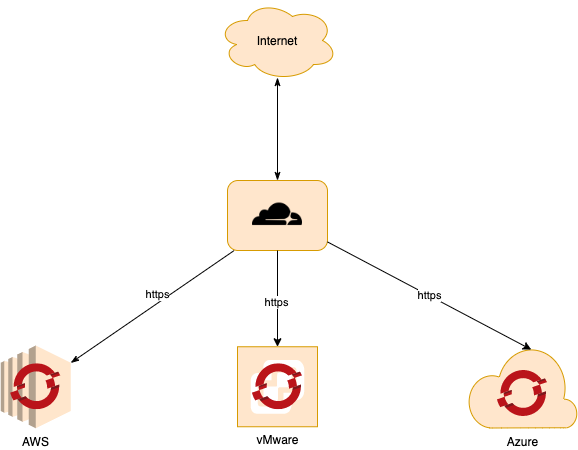
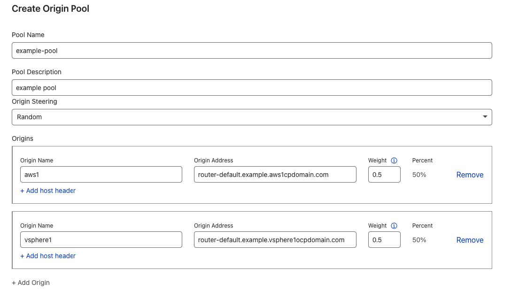

# Load Balancer/Fault Tolerance Configuration
For the OTP pattern when used in a hybrid multicloud sitution there is a need to be able to provide a unified and consistent end point even if one the cloud providers has a failure.

A solution is to use a 3rd party provider with their own infrastructure, that in the event of an outage on a cloud provider or even on prem will conttinue to keep operating, however this then itself becomes another single point of failure.  


## Cloudflare
The following documents how to setup CloudFlare and openshift to function as the load balancing solutiuon

   


For example if we want to expose an application called **app.myexample.com** we need to configure both CloudFlare and openshift


### Cloudflare configurtion
1. Traffic function of you cloudflare account, select load balancer and create a new load balancer
2. Enter the hostname e.g. **app.example.com** (you will need to have the base domain)
3. Create the pool, see below for example

   

4. Add any monitors needed, it could be a simple check to see if 200 OK is returned or something more complex, this will dependad on the application


### Openshift route configuration
In order for the cloudflare load balancer to work, the URL needs to be the same on the OCP route configuration, this is because cloudflare will send the **Host** header to the pool origin router. The router looks for this header to direct the inbound request to the right backend service.

The following is just an example, the tls and to sections will depend on your app and needs, but the key point to note is the host, it needs to match the the full hostname (**app.example.com**) that the load  balancer is created for.


```
kind: Route
apiVersion: route.openshift.io/v1
metadata:
  name: app-example
  namespace: openshift-gitops
spec:
  host: app.exmaple.com
  to:
    kind: Service
    name: example-service
    weight: 100
  port:
    targetPort: https
  tls:
    termination: passthrough
    insecureEdgeTerminationPolicy: Redirect
  wildcardPolicy: None
  ```