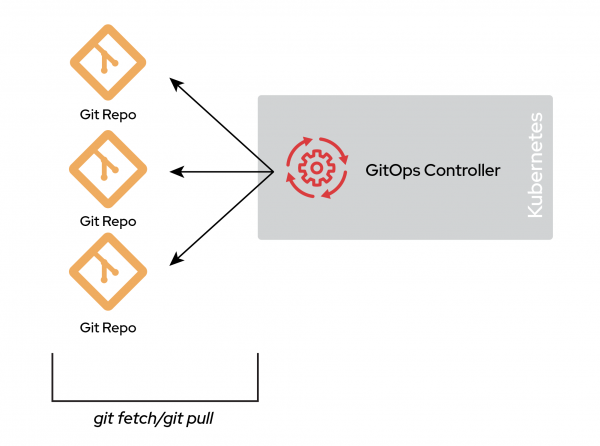
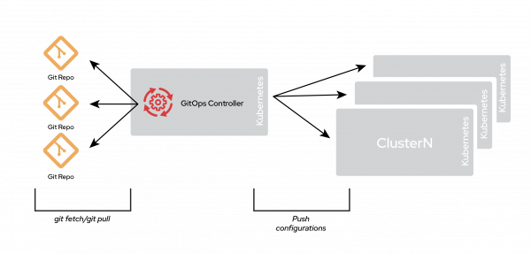
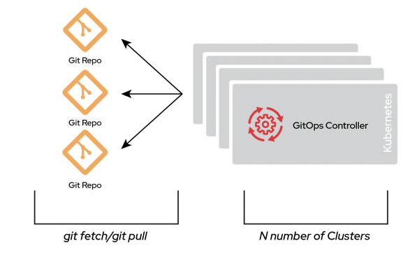
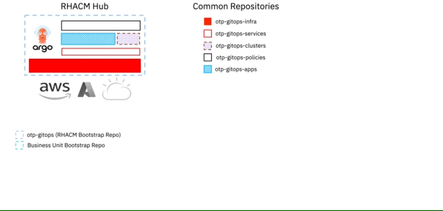

# Git Repositories Context

As mentioned previously, there are two patterns to consider when leveraging a GitOps workflow: Monorepo or Polyrepo.

## Monorepo

In a monorepo environment, all the manifests for the entire environment, including end-user applications, cluster configuration, and cluster bootstrapping, are stored in a single Git repository. This pattern applies not just to one cluster: every potential cluster in your environment is represented in this single repository.

  

The clear advantage of a monorepo is that it provides a central location for configuration changes. This simplicity enables straightforward Git workflows that will be centrally visible to the entire organization, making for a smoother and clearer approval process and merging.

There are several disadvantages, however. The first is scalability. As your organization grows, your environment also needs to grow with it, increasing the overall complexity of each deployment. This can make a monorepo difficult (even impossible) to manage.

There are also performance issues, especially if you use Argo CD. As the monorepo grows and changes become more and more frequent, the GitOps controller (for example, Argo CD) takes considerably more time to fetch the changes from the Git repository. This can slow down the reconciliation process and might slow down the correction of deviations from your desired state.

In short, although a monorepo is a valid choice, it can be quickly outgrown by the evolving requirements of the organization's operational needs. It can work if the team managing the environment is small enough and the repository manages only a handful of applications, environments, and clusters. Usually, startups and organizations just starting out with GitOps prefer this approach, which is perfectly valid. Another possible use case is when operating in a lab or another environment with a very limited domain for action.

## Polyrepo

A polyrepo environment contains multiple repositories, possibly to support many clusters or deployment environments. The basic idea is that a single cluster can have multiple repositories configured as a source of truth.

  

The differences between these Git repositories depend on several factors. A common example is separating concerns between different departments of an organization: a repository for the security team, a repository for the operations team, and one or more repositories for application teams. Another example involves multitenancy, where you have one repository per application.

You could run multiple GitOps controllers within a single cluster, or a GitOps controller can operate in a hub-and-spoke model

  

A polyrepo, therefore, permits many possible designs.

The primary characteristic of a polyrepo is that not everything is contained within a single repository and that you'll have a sort of catalog of what needs to go into an environment or cluster. The contents of these repositories are the topic of the next section.

One common polyrepo design is many-to-many, meaning that each repository points to a single cluster. This is a typical structure in a siloed organization where each team takes care of deploying its own infrastructure.

  

The drawback of a polyrepo is that it creates a large number of Git repositories to manage. The number of Git repositories depends on how your organization is laid out and how changes are managed. It's not unheard of for each repository to have its own associated Git workflow. This method can become hard to manage, but it scales incredibly well and is flexible enough to fit almost any organization.

## One Touch Provisioning Pattern

Our pattern for managing OpenShift Clusters, Applications, and Policies at scale is based on a decentralised approach that allows teams to work together effectively. Rather than relying on a single mono repository, we use multiple repositories that reflect the ownership and contributions of various personas. By doing this, we ensure that the configurations are fully replicated across all the environment, regardless of their location.

For instance, taking the Kubernetes Ownership Model, we looked at which personas would typically contribute and have ownership over a repository and separated a single mono repository into several to reflect that. An example would be a Platform team that primarily contributes and has ownership over a repository that defines the [infrastructure-related](https://github.com/one-touch-provisioning/otp-gitops-infra) components of a Kubernetes Cluster, e.g. namespaces, machinesets, ingress-controllers, storage etc, they may also be best placed to contribute and own a repository that defines how OpenShift [Clusters](https://github.com/one-touch-provisioning/otp-gitops-clusters) are created on different Cloud Providers. Similar examples can be given for a set of Services which support Application developers, where we would separate these into their own repositories, again owned and primarily contributed by a Services team. A Risk/Security team owning and primarily contributing to a [Policies](https://github.com/one-touch-provisioning/otp-gitops-policies) repository is another example.

We enable these repositories as centralised repositories at an organisational, business or product level, where each OpenShift Cluster, including the Hub Cluster, is deployed with OpenShift GitOps (aka ArgoCD). This allows for easy management and ensures that deployed OpenShift Clusters share the same configuration, reducing duplicated code, and maintaining conformance.

Our approach allows for a lower barrier to entry for developers as they can easily access and understand the Git repositories, thereby reducing costs for change and opening up opportunities for innovation

  For our pattern, we've termed the above 1 + 5 + n Git Repositories.

  * 1 Repository being the Red Hat Advanced Cluster Management Hub Cluster

  * 5 Repositories (Infrastructure, Services, Applications, Clusters, Policies) being common / shared

  * n Repository being the repository that you will use to bootstrap your deployed managed OpenShift Cluster

Our approach ensures a scalable and efficient way to manage OpenShift Clusters, Applications, and Policies at scale.

  

    
  

 

(<a href="https://github.com/one-touch-provisioning/otp-gitops/">back to main</a>)
