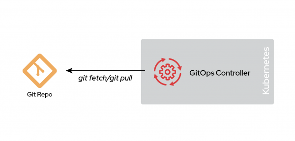

# Git Repositories Context

When implementing a GitOps workflow, organizations typically choose between two patterns: Monorepo or Polyrepo. Each approach has its own advantages and use cases, which we'll explore in detail below.

## Monorepo

In a monorepo environment, all manifests for your entire environment - including end-user applications, cluster configuration, and cluster bootstrapping - are stored in a single Git repository. This pattern extends beyond individual clusters: every potential cluster in your environment is represented within this unified repository.

  

The primary advantage of a monorepo is its centralized configuration management. This simplicity enables straightforward Git workflows that are visible to the entire organization, streamlining the approval process and making merges more transparent.

However, there are notable disadvantages to consider. The first is scalability. As your organization grows, your environment complexity increases, potentially making the monorepo challenging to manage effectively.

Performance can also become an issue, particularly when using Argo CD. As the monorepo expands and changes become more frequent, the GitOps controller (like Argo CD) requires more time to fetch changes from the Git repository. This can slow down the reconciliation process and potentially delay the correction of state deviations.

While a monorepo is a valid choice, it may not scale well with evolving organizational needs. It works best when:
- The team managing the environment is small
- The repository manages only a handful of applications, environments, and clusters
- You're a startup or organization just beginning with GitOps
- You're operating in a lab or limited-scope environment

## Polyrepo

A polyrepo environment utilizes multiple repositories to support various clusters or deployment environments. The core concept is that a single cluster can have multiple repositories serving as sources of truth.

  

The separation between these Git repositories can be based on several factors. Common examples include:
- Department-specific repositories (security team, operations team, application teams)
- Multitenancy scenarios with one repository per application

You can run multiple GitOps controllers within a single cluster, or implement a GitOps controller in a hub-and-spoke model:

  

A polyrepo offers numerous design possibilities. Its key characteristic is the distribution of configuration across multiple repositories, creating a catalog of what needs to be deployed into an environment or cluster.

A common polyrepo design is many-to-many, where each repository points to a single cluster. This structure is typical in siloed organizations where teams manage their own infrastructure deployments.

  

The main challenge with a polyrepo is managing multiple Git repositories. The number of repositories depends on your organizational structure and change management processes. Each repository may have its own Git workflow, which can become complex to manage. However, this approach scales exceptionally well and offers the flexibility to adapt to almost any organizational structure.

## One Touch Provisioning Pattern

Our pattern for managing OpenShift Clusters, Applications, and Policies at scale is based on a decentralized approach that enables effective team collaboration. Instead of using a single monorepo, we leverage multiple repositories that reflect the ownership and contributions of different personas. This ensures consistent configuration replication across all environments, regardless of their location.

Following the Kubernetes Ownership Model, we've organized repositories based on the personas that typically contribute to and own them. For example:
- Platform teams own repositories for [infrastructure-related](https://github.com/one-touch-provisioning/otp-gitops-infra) components (namespaces, machinesets, ingress-controllers, storage)
- Platform teams also manage repositories defining how OpenShift [Clusters](https://github.com/one-touch-provisioning/otp-gitops-clusters) are created across different Cloud Providers
- Service teams own repositories for supporting Application developers
- Risk/Security teams own and contribute to [Policies](https://github.com/one-touch-provisioning/otp-gitops-policies) repositories

We implement these as centralized repositories at the organizational, business, or product level. Each OpenShift Cluster, including the Hub Cluster, is deployed with OpenShift GitOps (ArgoCD). This approach:
- Simplifies management
- Ensures consistent configuration across deployed OpenShift Clusters
- Reduces code duplication
- Maintains conformance

Our approach lowers the barrier to entry for developers, making Git repositories more accessible and understandable. This reduces the cost of change and fosters innovation.

We've structured our pattern as "1 + 5 + n" Git Repositories:
- 1 Repository for the Red Hat Advanced Cluster Management Hub Cluster
- 5 Common/shared Repositories (Infrastructure, Services, Applications, Clusters, Policies)
- n Repositories for bootstrapping your deployed managed OpenShift Clusters

This structure provides a scalable and efficient way to manage OpenShift Clusters, Applications, and Policies at scale.

  

(<a href="https://github.com/one-touch-provisioning/otp-gitops/">back to main</a>)
