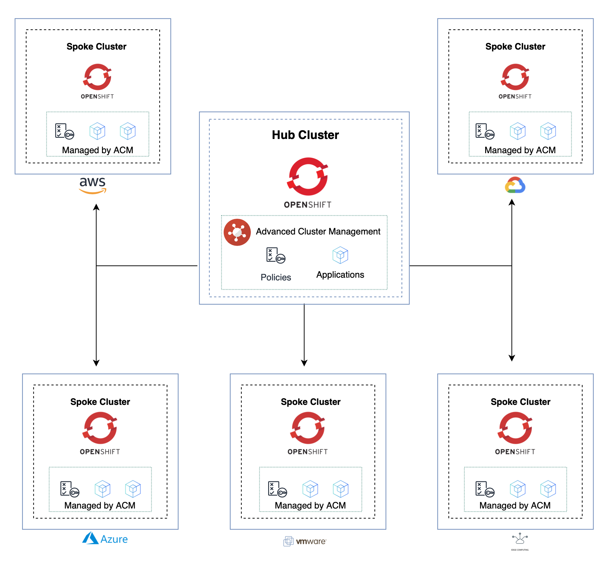

# Red Hat Advanced Cluster Management Hub and Spoke Clusters Concepts
  
We leverage two Open Source technologies to underpin the functionality within this pattern. One is ArgoCD (aka OpenShift Gitops) and the other is Open Cluster Management (aka Red Hat Advanced Cluster Management or RHACM).

To fully appreciate the terminology used within RHACM and more so within the pattern, we will spend a few moments helping provide some context.

RHACM is built around a Hub and Spoke architecture. With the Hub Cluster, running RHACM, providing cluster and application lifecycle along with other aspects such as Governance and Observability of any Spoke Clusters under it's management.

The diagram below shows a typical Hub and Spoke deployment over various clouds.

  

    
  

(<a href="https://github.com/one-touch-provisioning/otp-gitops/">back to main</a>)
